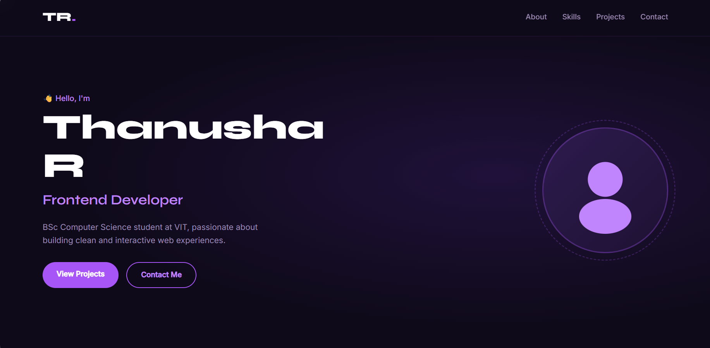

# Portfolio Website 🌐

A modern personal portfolio website showcasing my skills, projects, achievements, and contact information. Designed to provide recruiters and visitors with a quick overview of my work and technical abilities.

## 🚀 Features

* Smooth scrolling navigation
* Animated typing effect
* Responsive design for desktop and mobile devices
* Skills section with progress indicators
* Project showcase with live demos and GitHub links
* Contact section
* Modern and clean user interface

## 🛠️ Tech Stack

* HTML5
* CSS3
* JavaScript (ES6)

## 📂 Sections

* Home
* About Me
* Skills
* Projects
* Contact

## 🌐 Live Demo

https://thanusha-r.github.io/portfolio-website/
## 📸 Screenshot

## 📸 Projects Showcased

* TodoPro – Task Management Application
* WeatherMood – Weather Forecast & Mood Suggestion App
* ShopEasy – E-Commerce Web Application
* Portfolio Website

## ▶️ How to Run Locally

1. Clone this repository
2. Open the project folder
3. Open `index.html` in your browser

## 👨‍💻 Author

Thanusha R

Frontend Developer | BSc Computer Science Student

GitHub: https://github.com/thanusha-r
